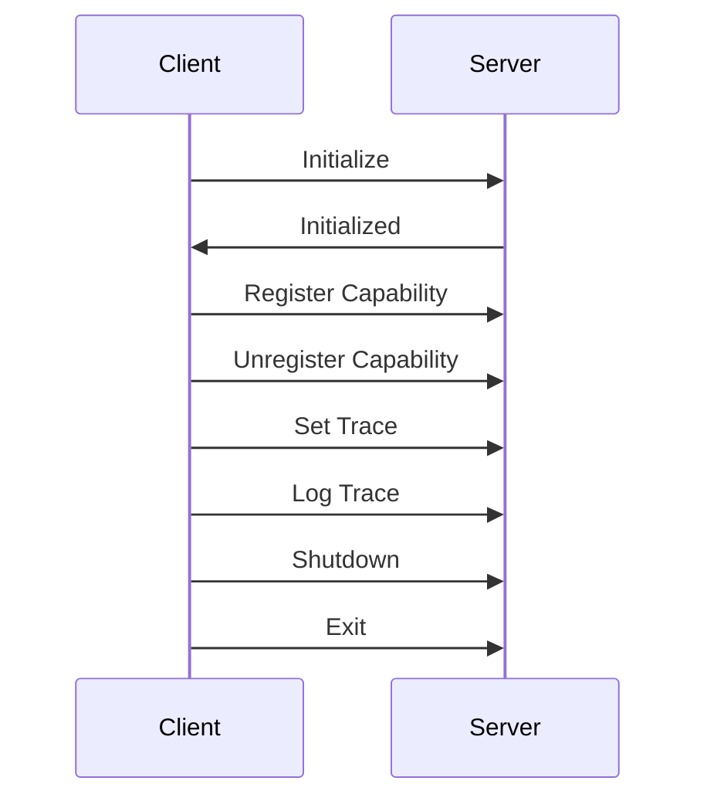

Since its introduction, MCP has sparked fascinating discussions across developer communities. If you're new to the concept, you can browse Reddit to see the ongoing debate surrounding it, with both proponents and opponents.

When I first discovered MCP in late November 2024, I was immediately intrigued by its potential. It seemed like the missing piece in how we communicate with systems using natural language—a problem I was already trying to tackle with my CLI tools `gyat` and `hapi`. I created a [blog](https://apicove.com/blog) to help others understand these tools and make API interactions more human-friendly. However, these tools worked algorithmically with deterministic workflows; they couldn't systematically interact with AI models.

Anthropic's MCP caught my attention because it **appeared to offer a solution**—a way to standardize natural language communication with systems, benefiting both developers and users. Initially, I saw MCP as a protocol that could bridge the gap between human language and machine comprehension.

## My Journey with MCP

I immediately began experimenting with MCP, integrating it into my tools and workflows. The simplicity of adding tools to Claude's desktop interface was compelling—it felt like a natural evolution beyond traditional APIs and protocols.

However, there was a catch. The initial learning curve was steep, and troubleshooting was a challenging task. I wanted to help others facing similar struggles by making MCP more accessible without requiring deep technical understanding.

Through writing about my experiences and sharing practical tips, my understanding evolved in tandem with the specifications. A pivotal moment came when MCP introduced **Streamable HTTP** (Protocol Revision: 2025-03-26) as a transport method. This shift helped me realize that **MCP isn't purely a protocol—it's fundamentally a contract** that emphasizes interaction semantics rather than just data transfer mechanics.

This revelation clarified how MCP could function at a higher level. Since my `gyat` and `hapi` CLI tools were designed to be API-first, and MCP fits seamlessly into that approach—not just defining how systems communicate, but how they should behave.

## The LSP Connection: Understanding MCP's Roots

To understand what MCP truly is, let's examine its foundation. Do you recognize this JSON structure?

```json
Content-Length: ...\r\n
\r\n
{
	"jsonrpc": "2.0",
	"id": 1,
	"method": "textDocument/completion",
	"params": {
		...
	}
}
```


What about these TypeScript interfaces?

```typescript
interface RequestMessage extends Message {
	/**
	 * The request id.
	 */
	id: integer | string;

	/**
	 * The method to be invoked.
	 */
	method: string;

	/**
	 * The method's params.
	 */
	params?: array | object;
}

interface ResponseMessage extends Message {
	/**
	 * The request id.
	 */
	id: integer | string | null;

	/**
	 * The result of a request. This member is REQUIRED on success.
	 * This member MUST NOT exist if there was an error invoking the method.
	 */
	result?: LSPAny;

	/**
	 * The error object in case a request fails.
	 */
	error?: ResponseError;
}
```

No, it is not MCP. This is the [**Language Server Protocol (LSP)**](https://microsoft.github.io/language-server-protocol/specifications/lsp/3.17/specification/#contentPart)—a protocol that standardizes how development tools communicate with programming language servers. LSP enables editors and IDEs to provide features such as code completion, linting, and refactoring **across different languages without implementing language-specific logic in each tool**.

The lifecycle message flows of LSP and MCP are strikingly similar:




### Why LSP Matters for Understanding MCP?

LSP revolutionized software development by solving a critical integration problem. Before LSP, supporting code intelligence across multiple programming languages meant **writing M × N integrations—M tools for N editors**. Each language had its peculiarities, and each editor had its API, resulting in expensive, fragile, and inefficient custom integrations.

LSP introduced a **universal interface** for language servers. Instead of each editor implementing custom logic for every language, they could all speak the same protocol. **Once a language server was built, any LSP-compliant editor could use it.**

**Sound familiar?** This is precisely what MCP aims to achieve for AI model interactions. *Once an API implements an MCP Server, any compliant client can interact with it without needing custom logic for each client*.

## The Strategic Launch: Lucky or Smart?

**Timeline:**

* MCP SDK made [public on GitHub: October 23rd, 2024](https://github.com/modelcontextprotocol/typescript-sdk/releases/tag/0.1.0)
    
* Claude desktop [released: October 31st, 2024](https://docs.anthropic.com/en/release-notes/claude-apps#october-31st%2C-2024)
    

The buzz around MCP is largely thanks to Claude desktop—the first MCP client. Anthropic made a brilliant move by recognizing LSP's potential and applying similar principles to AI model interactions.

Despite the controversial choice of using `stdio` as the initial transport layer, it was strategically sound, providing a lightweight and efficient communication method that made it easier for developers to build AI-powered tools locally.

Why not use HTTP? **HTTP is a heavyweight protocol** with built-in features that aren't always necessary for simple interactions. `stdio` is simpler, faster, and more direct—ideal for local applications where both client and server are on the same machine, which was the case for Claude desktop and the initial MCP implementations.

### Understanding STDIO

**STDIO (Standard Input/Output)** is defined by the C runtime and inherited by UNIX-like systems, consisting of three standard file descriptors:

* **stdin** (0): input stream
    
* **stdout** (1): output stream
    
* **stderr** (2): error stream
    

These are simply **file streams**, often attached to terminals, pipes, or redirected. STDIO serves as the transport layer for higher-level protocols.

**Analogy:** If **HTTP is like postal mail**, STDIO is like **hand-delivering messages through a tube**—simpler, faster, and ideal when sender and receiver are in close proximity.


The community's push toward HTTP as a transport layer makes sense—it's familiar, widely supported, and includes built-in features like headers, status codes, and content negotiation. For me, the introduction of [Streamable HTTP](https://modelcontextprotocol.io/specification/2025-03-26/basic/transports#streamable-http) transport in `version 2025-03-26` was transformative, making MCP more accessible and easier to integrate into existing systems.

## MCP as Contract, Not Protocol

This brings us to the core insight: **MCP is not just another protocol; it's a semantic layer** that enables **intelligent API interactions**. It allows agents to understand not only the data, but also the **intent and context** behind it.

Consider this question: *Where do tools like Swagger/OpenAPI Specification (OAS) fit into networking architectures such as the OSI model?*

They don't fit neatly, and that's perfectly fine. **Swagger/OAS isn't a protocol in the traditional sense—it's a contract** that defines how systems should interact.

### Why Swagger/OAS Doesn't Fit the OSI Model

The **OSI model** describes **how** data is transmitted across networks—from physical wire (Layer 1) to applications (Layer 7).

Swagger/OAS, by contrast:

* Doesn't handle **transport** (Layer 4)
    
* Doesn't define **sessions** (Layer 5)
    
* Isn't concerned with **encoding** (Layer 6)
    
* It isn’t a **runtime application** (Layer 7)
    

Instead, it:

* **Describes APIs**—endpoints, parameters, responses, and authentication
    
* **Acts as metadata** for client-service interactions over HTTP
    

This is **meta-communication**—a **contract**, not transmission itself.

### The "Layer 8" Concept

I would place Swagger in [**Layer 8**](https://en.wikipedia.org/wiki/Layer_8)**: "People, Policies, and Planning"**—where developers, product managers, and architects live. It's about human **agreement**, **specification**, and **negotiation** of service interfaces.

**Analogy:** If the OSI model is a road system:

* Layers 1–4 are asphalt, traffic rules, intersections, and cars.
    
* Layers 5–7 are comprised of drivers, GPS, and mobile apps, which send and receive instructions.
    
* **Swagger/OAS** is the *roadmap and city planning documentation* telling drivers and managers how roads should be used.
    

### MCP Operates in the Intent Layer

In **intent-based systems** (like MCP or autonomous agents), specifications like Swagger or gRPC play crucial roles:

* Declaring **intent**
    
* Providing **machine-readable contracts**
    
* Powering **automation, code generation, testing, and governance**
    

In modern cloud-native and AI-centric architectures, these tools reside in the intent/control plane—often referred to as **Layer 8+** or **"Layer 9: Governance/Compliance."**

## Summary: Contract vs. Protocol

| **Aspect** | **OSI Equivalent** | **Why It's Different** |
| --- | --- | --- |
| Describes APIs over HTTP | Above Layer 7 | It's metadata, not data |
| Exists at design time | Layer 8 (People) | It's a contract, not a protocol |
| Used by Devs & Tools | Layer 8/9 | Focused on agreement & automation |
| Does not transmit data | Not in OSI | Doesn't live in the data plane |

**Key Insight:** Swagger/OAS is what *developers* and *machines* use to agree **on how** to communicate, but it doesn't do the communicating itself.

Similarly, **MCP lives in "Layer 8"—the realm of contracts, conventions, and collaboration.** It's not a limitation; it's evolution from "transporting data" to "understanding and automating intent."

## Why This Matters: MCP's Real Value

Anthropic's genius was leveraging this intent-layer understanding to create a more intuitive interface for AI model interactions. MCP wasn't just another specification—it was a way to make AI more accessible and practical.

The introduction of [Streamable HTTP](https://modelcontextprotocol.io/specification/2025-03-26/basic/transports#streamable-http) transport was my AHA moment, making integration with existing systems seamless. When I finally understood **MCP as a contract rather than a protocol**, everything fell into place.

## Looking Forward: MCP in Enterprise

In regulated industries—such as banking, healthcare, and defense—contracts are paramount. MCP's explicit semantic layer maps directly to compliance requirements:

* **Audit Trails:** Each message logged with context keys
    
* **Policy Enforcement:** Only approved message types pass through
    
* **Version Control:** Upgrade contracts without breaking consumers
    

With modern deployment stacks, you can deploy MCP servers using GitOps, ensuring every revision is tracked, tested, and approved.

## Conclusion

What began as curiosity about a new protocol evolved into a deeper understanding of how AI systems can better serve human needs. **MCP isn't just about data exchange—it's about creating meaningful, contextual interactions** between humans and AI.

By recognizing MCP as a contract that operates in the intent layer, we can build more reliable, maintainable, and robust AI integrations. It's not about the transport mechanism; it's about the semantic agreement that enables intelligent automation.

I have been working with the [HAPI Stack for MCP](https://mpc.com.ai), which aims to provide a comprehensive framework for building and deploying API-first MCP-based applications. It simplifies the integration and deployment of MCP-based applications, allowing developers to focus on creating intelligent systems without getting bogged down in low-level details.


Please review the [HAPI Stack documentation](https://docs.hapi.com.ai) to learn how it can help you build robust, intent-driven applications using MCP.

## Further Reading

* [LSP Specification](https://microsoft.github.io/language-server-protocol/specifications/lsp/3.17/specification)
    
* [Language Server Protocol](https://langserver.org)
    
* [Model Context Protocol (MCP)](https://modelcontextprotocol.io)
    
* [MCP as Contracts documentation](https://docs.mcp.com.ai)
    

---

*This post was brought to you by someone who once thought MCP was just another protocol—and is now convinced it's a contract that unlocks smarter, more reliable AI integrations.*

Go Rebels! ✊🏽
