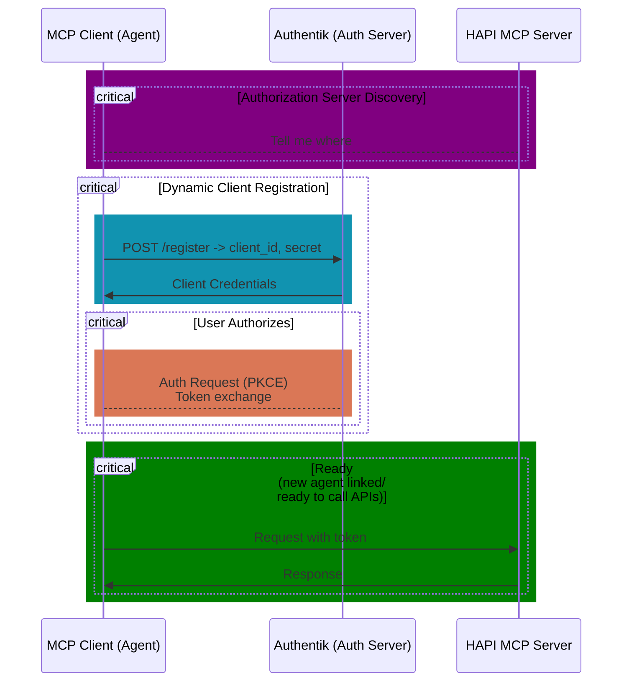

**Remember when you only had one password for everything?** That era is long gone. Today, apps, cloud services, and AI agents all need to talk to each other — securely, automatically, and at scale. The silent hero making this possible: **OAuth**.

* How many applications can you think of that use OAuth for authentication and authorization?
    
* How many applications had you actually approved with your social login!?
    

But OAuth itself has evolved. As the AI ecosystem grows, we're witnessing a new level of demand for **Dynamic Client Registration (DCR)** — the ability for clients to register with an authorization server *on the fly*.

This post is your guide:

* How OAuth has changed (and why it matters).
    
* Why **Dynamic Client Registration** is a cornerstone for multi-tenant and AI-driven systems.
    
* How the **Model Context Protocol (MCP)** is adopting these patterns.
    
* And a practical **step-by-step with Authentik and the HAPI MCP Server** to ground it all.
    

---


## 1\. OAuth's Evolution: From Delegation to Identity to Best Practice

Let's start simple.

* **OAuth 2.0 (2012):** The original delegation protocol. It let apps request access to resources on your behalf (e.g., a calendar app accessing your Google Calendar). But it was flexible — sometimes too flexible. Some flows turned out to be insecure.
    
* **OpenID Connect (2014):** A layer on top of OAuth 2.0. It added an **ID token** so apps could also *know who you are* — not just access your data. Think of it as turning OAuth into both an **access key** *and* a **passport**.
    
* **OAuth 2.1 (draft, 2020+):** A cleanup spec. It didn't reinvent the wheel — it just enforced **best practices** learned over a decade:
    
    * No more Implicit or Password flows.
        
    * **PKCE everywhere.**
        
    * **Refresh token rotation.**
        
    * TLS mandatory.
        
    * Discovery & registration treated as first-class citizens.
        

👉 In short: OAuth matured from a flexible toolkit to a **secure, standardized foundation**.

---

## 2\. Why Dynamic Client Registration Matters Now

Static client registration works fine if you're only registering a handful of apps. But what if:

* You're running a **multi-tenant SaaS platform** with thousands of customers, each needing isolated integrations?
    
* You're building **AI agent ecosystems**, where agents spawn dynamically and need credentials to access APIs in real time?
    
    * With [MCP](ttps://modelcontextprotocol.io), these agents can self-register and obtain the necessary credentials without manual intervention.
        

That's where **Dynamic Client Registration (RFC 7591)** comes in:

* Clients can **register programmatically** with an Authorization Server.
    
* They receive credentials (client ID, secrets, etc.) automatically.
    
* They can operate without human intervention.
    

This matters because:

* **Cost savings:** No manual provisioning overhead.
    
* **Scalability:** Hundreds or thousands of clients → no problem.
    
* **Security:** Credentials are issued and rotated via defined policies.
    

Without DCR, scaling modern environments is like trying to hand out car keys at a concert — messy, error-prone, and slow.

---

## 3\. MCP and Dynamic Registration: A Perfect Fit

Fast forward to **today's AI-driven world**. Enter the **Model Context Protocol (MCP)** — an emerging specification defining how AI systems interact securely and consistently with external tools, APIs, and resources.

From the [MCP specification (June 2025 release)](https://modelcontextprotocol.io/specification/2025-06-18/basic/authorization#dynamic-client-registration):

> "Dynamic Client Registration enables MCP clients to register securely with authorization servers, supporting environments with high client churn such as multi-agent systems."

What this means in plain language:

* AI agents (think assistants, copilots, bots) can **self-register** with a system.
    
* No admin has to pre-configure each one.
    
* The authorization flow is standardized, portable, and safe.
    

MCP leverages the OAuth ecosystem — **discovery, PKCE, and DCR** — to make this seamless.

This is big. Imagine AI agents spinning up per request, each one negotiating its credentials securely without any human intervention. That's the kind of automation we're heading toward.

---

## 4\. Example: Authentik + HAPI MCP Server

Enough theory — let's make it real.

Imagine you're deploying [**Authentik**](https://docs.goauthentik.io/) (an open-source Identity Provider) as your authorization server, and you want your AI agents running in the **HAPI MCP Server** ([hapi.mcp.com.ai](https://hapi.mcp.com.ai)) to register dynamically.

Here's the simplified step-by-step flow; for more details, refer to the [MCP specification](https://modelcontextprotocol.io/specification/2025-06-18/basic/authorization#dynamic-client-registration).



### Step 1. Discovery

* The MCP client queries something without a token,
    
* The MCP Server responds with the **discovery endpoint**:
    

```graphql
https://<authentik-domain>/.well-known/openid-configuration
```

> "I can't grant you access without a token. Check with Auth Server for details."

* From here, it learns where to send authorization and registration requests.
    

### Step 2. Dynamic Client Registration

* The MCP client calls Authentik's registration endpoint (from discovery metadata):
    

```graphql
POST /application/o/token/
Content-Type: application/json
{
  "client_name": "hapi-agent-123",
  "redirect_uris": ["https://hapi.mcp.com.ai/callback"],
  "grant_types": ["authorization_code"],
  "response_types": ["code"],
  "token_endpoint_auth_method": "none"
}
```

* Authentik returns:
    

```graphql
{
  "client_id": "abc123",
  "client_secret": "xyz789",    // <-- optional, two client types
  "registration_access_token": "rat_456"
}
```

[**OAuth 2.1**](https://datatracker.ietf.org/doc/html/draft-ietf-oauth-v2-1-13#name-client-types) defines **two client types** based on their ability to authenticate securely with the authorization server:

* "**confidential**": Clients that have credentials with the Authorization Server (AS) are designated as "confidential clients"
    
* "**public**": Clients without credentials are referred to as "public clients." Public clients are incapable of maintaining confidentiality and should utilize methods like **PKCE**.
    

### Step 3. Authorization Code + PKCE Flow

* The MCP client (HAPI agent) initiates an auth request:
    

```graphql
GET /application/o/authorize?
    response_type=code
    &client_id=abc123
    &redirect_uri=https://client.mcp.com.ai/callback
    &scope=openid profile
    &code_challenge=... 
    &code_challenge_method=S256
```

* Authentik handles user consent, then redirects back to HAPI MCP Client with an authorization code.
    

### Step 4. Token Exchange

* The HAPI MCP Client exchanges the code (with PKCE verifier) at Authentik's token endpoint:
    

```graphql
POST /application/o/token/
grant_type=authorization_code
code=...
client_id=abc123
code_verifier=...
```

* Authentik issues **access + refresh tokens**.
    

### Step 5. Agent Ready

* Now the HAPI MCP agent can call APIs securely, and if refresh tokens rotate, it seamlessly handles renewal.
    

---

## 5\. Why This Matters

By combining **OAuth 2.1 best practices**, **Dynamic Client Registration**, and the **MCP standard**, you get:

* **Seamless scaling** of clients/agents.
    
* **Zero manual overhead** for new tenants or AI workloads.
    
* **Security baked in** with PKCE, HTTPS, and rotation.
    
* **Interoperability** — the same flows work across Authentik, Keycloak, Azure AD, and beyond.
    

This isn't just theory. It's the backbone for the **next generation of AI-native infrastructure**.

---

## Final Thought

OAuth originated as a method for logging in with your Google account. Today, it's the glue that lets **AI agents, SaaS platforms, and enterprises** interact safely and automatically. [OpenID Connect (OIDC) becoming an ISO standard](https://rebelion.la/why-oidc-becoming-iso-matters) matters now more than ever.

And if you're ready to experiment:

👉 Try spinning up an agent with the [**HAPI MCP Server**](https://hapi.mcp.com.ai) and plug it into Authentik. You'll see just how powerful Dynamic Client Registration is when theory meets practice.

The magic of HAPI Server is that it simplifies the implementation of OAuth 2.1 flows out of the box, using just the Swagger Specs and zero coding, making it easier for developers to build secure and scalable applications. PMs can spin up new agents in minutes, not weeks.

Go Rebels! ✊🏽
