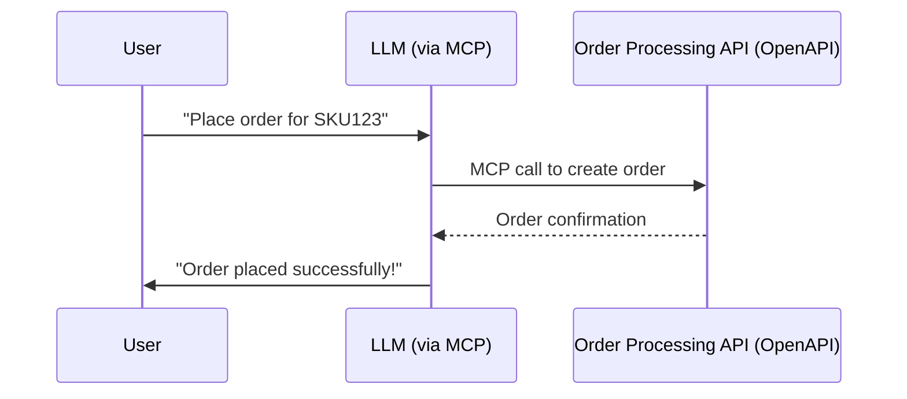
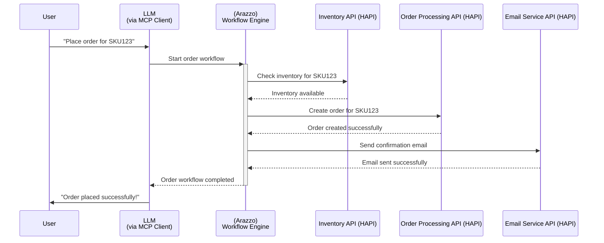

What’s possible when you mix [**OpenAPI**](https://swagger.io/specification/v3), the [**Model Context Protocol**](https://modelcontextprotocol.io/) **(MCP)**, and the [**Arazzo Specification**](https://spec.openapis.org/arazzo/latest.html)?

In one word: **everything.**

We’re standing on the edge of a new era in **AI automation**—where workflows that once took weeks to wire up across APIs, SDKs, and custom scripts could soon be described, orchestrated, and executed **seamlessly**.

---

## Why This Formula Matters

The combination of **OpenAPI**, **MCP**, and **Arazzo** is transformative for AI-powered automation:

* **OpenAPI** provides a universal language to describe APIs—a trusted **blueprint** that ensures clarity and consistency across systems.
    
* **MCP** introduces a **native protocol** for LLMs to interact with APIs directly—eliminating hacks and workarounds. It acts as the **bridge**, enabling seamless communication between AI agents and APIs.
    
* **Arazzo** serves as the **orchestration layer**, defining workflows as portable, spec-driven processes. It’s the **glue** that binds everything together.
    

This synergy means you’re no longer confined to a single ecosystem and vendor lock-in like n8n, LangFlow, Flowise, or traditional engines like Temporal or Camunda. With **Arazzo as the workflow layer**, you can orchestrate processes across **any system** while maintaining the confidence and reliability of an [API-first approach](https://swagger.io/resources/articles/adopting-an-api-first-approach/).

By leveraging these standards, you unlock a future where AI workflows are not only powerful but also portable, scalable, and ecosystem-agnostic.

The result? An LLM can take “**Place an order for SKU123**” and autonomously execute the workflow across services with full visibility.

### MCP + OpenAPI in Action

Imagine you’ve got an API for order processing:



### Adding Arazzo to the mix

Now, let’s say placing an order involves multiple steps: checking inventory, processing payment, and sending a confirmation email. Here’s how Arazzo orchestrates that process in a structured, spec-driven way:

```yaml
arazzo: 1.0.0
info:
  title: AI Order Workflow
  version: 1.0.0
workflow:
  - step: checkInventory
    description: "Verify if the requested SKU is available in inventory."
    call:
      operationId: getInventory
    next: [createOrder]
  - step: createOrder
    description: "Create an order for the requested SKU after inventory confirmation."
    call:
      operationId: postOrder
    next: [sendConfirmation]
  - step: sendConfirmation
    description: "Send a confirmation email to the user after the order is successfully created."
    call:
      operationId: postEmail
```

This YAML specification defines a clear, step-by-step workflow for placing an order. Each step is described with its purpose, the API operation it calls, and the next step(s) in the sequence. This makes the workflow not only executable but also easy to understand and maintain.

How does this play out in practice? Here’s the sequence of interactions visualized:



In this diagram:

1. The **User** initiates the process by requesting to place an order in natural language.
    
2. The **LLM**, using the MCP protocol, delegates the workflow execution to the **Arazzo Workflow Engine**.
    
3. Arazzo orchestrates the steps:
    
    * It first checks the inventory via the **Inventory API**.
        
    * If inventory is available, it proceeds to create the order using the **Order Processing API**.
        
    * Finally, it sends a confirmation email through the **Email Service API**.
        
4. Once all steps are completed, Arazzo reports back to the LLM, which informs the user of the successful order placement.
    

Because this workflow is defined in a spec-driven manner, it is portable across platforms like [n8n](https://n8n.io), [LangFlow](https://docs.langflow.org/concepts-flows), [Temporal](https://temporal.io/solutions/ai), or [Camunda](https://camunda.com/solutions/api-orchestration/). Arazzo ensures that the logic remains consistent and reusable, regardless of the underlying execution engine.

This approach not only simplifies complex workflows but also makes them scalable, maintainable, and transparent—key factors for building robust AI-powered automation systems.

---

## The real business impact

Executives care about **cost, speed, and risk.** Developers care about **standards and reusability.** Operators care about **observability and maintainability.**

This formula speaks to all of them:

* Faster integration = faster time-to-market
    
* Standards = reduced tech debt and vendor lock-in
    
* Clear orchestration = predictable, auditable AI-powered workflows
    

It’s not just about building cool AI toys—it’s about **building resilient, future-proof business systems.**

---

## Why I’m excited about Arazzo

The **Arazzo Spec** feels like the orchestration layer AI has been waiting for. Imagine telling your AI agent not just *what* API to call (that’s OpenAPI), or *how* to connect to it (that’s MCP), but also *why, when, and in what order*.

That’s Arazzo. That’s **AI workflows as code.**

This opens the door to something bigger: **cross-platform automation without silos.**

---

## Where the [HAPI Stack](https://docs.mcp.com.ai/components) fits

The [HAPI Stack for MCP](https://mcp.com.ai) explores how these standards—OpenAPI, MCP, and now Arazzo—can accelerate the **API-First + AI-Orchestration future.** Instead of reinventing the wheel every time, we’re building with **standards-first tooling** that makes it easier to go from idea → workflow → production.

---

## What is your take?

I’d love to hear your take

* Do you see **Arazzo** becoming the universal glue for workflows?
    
* How do you imagine **AI agents** benefiting from an OpenAPI + MCP + Arazzo formula?
    
* What opportunities—or challenges—do you see for your teams or projects?
    

Check out the Arazzo spec here: [Arazzo Latest Draft](https://spec.openapis.org/arazzo/latest.html) and the deep dive here: [Swagger Blog](https://swagger.io/blog/the-arazzo-specification-a-deep-dive/).

Let’s spark a conversation about what’s next—because **this might just be the foundation of AI-native automation.**

Go Rebels! ✊🏽
